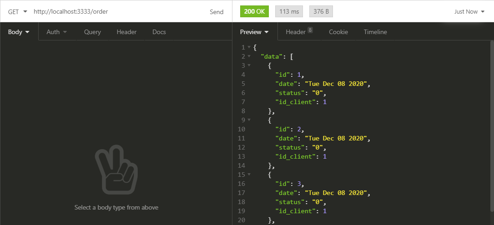

## Backend_Dellen
### Backend de loja virtual.

**Como testar**:
Para testar o projeto é necessário o instalação do postgresql e pgadmin.
- Postgresql com pgadmin:
     - [Ubuntu](https://websiteforstudents.com/install-postgresql-with-pgadmin-on-ubuntu-20-04-18-04/)
     - [Windows](https://www.guru99.com/download-install-postgresql.html)

Após feito essa etapa é necessário criar uma servidor no pgadmin e executar a query contida em <code>backend_dellen/scripts.sql</code>

-  Download dependências: <code>npm install</code>
-  Lembrar de modificar as credenciais do banco de dados para conexão em <code>/.src/database/connection.js</code>
-  Testar o projeto: <code>nodemon ./src/server.js</code>

Para testar as rotas foi utilizado o Insomnia.
Arquivo de rotas em  <code>backend_dellen/Insomnia_2020-12-08.json</code>

## Rotas
- Cadastrar cliente 
 
 - Cadastrar Administrador
 
 - Cadastrar Categoria de Produto
 
 - Cadastrar Cadastrar Produto
 
 - Fazer uma Compra
 O array no json significa: <code>"products":[ [id_product1, quantity_of_product1, price_of_product1],[id_product2, quantity_of_product2, price_of_product2]]</code>
 
 - Listar Todas as Compras
 
 - Listar compras do cliente
 